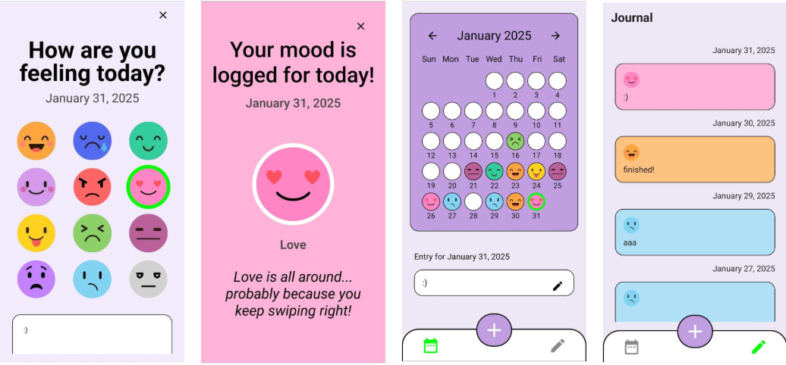

## MoodMoji App 
The code for this project is currently in the **master** branch.

**Description**  
The cute animated design-inspired mood-tracking app allows users to input their daily thoughts and emotions through emojis and journal writing.

**App Concept**  
Use Case: The app helps users develop a habit of self-reflection and emotional awareness by providing a simple, visually appealing way to track their daily moods and thoughts. Individuals aged 13 and above who enjoy introspection and journaling, as well as those seeking a supportive tool to track and better understand their emotions.

**App Screenshots**

**Group Project 👥**  
This app was developed as a **group project** and posted under the university account **cc231036** 🎓. Contributors include cc231045. All the **details and conducted usability reseach** and it's details are on the university account.
